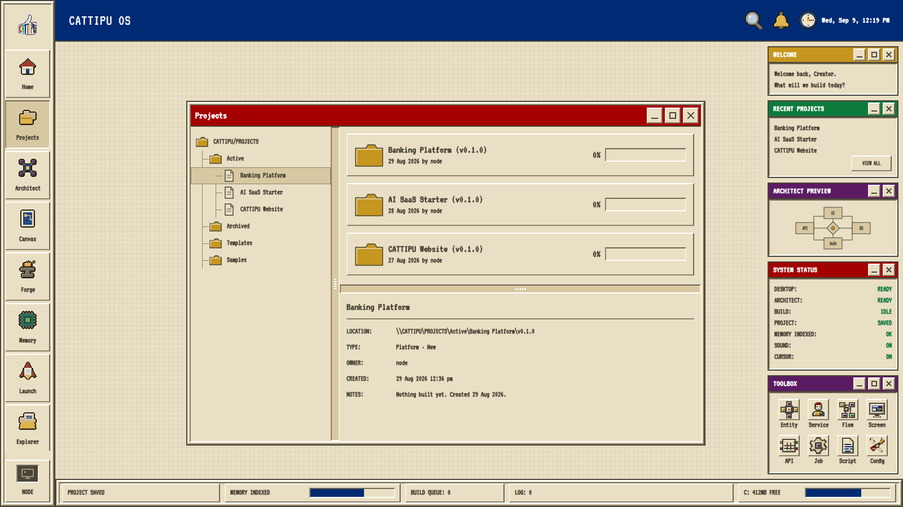
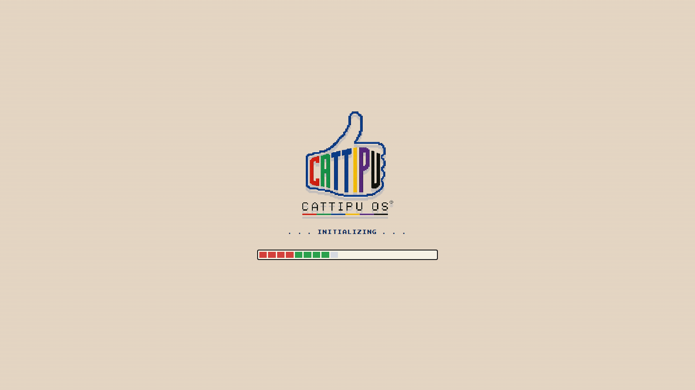
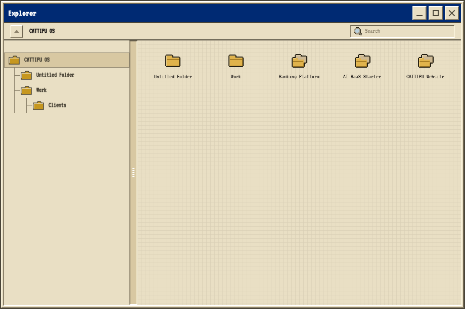
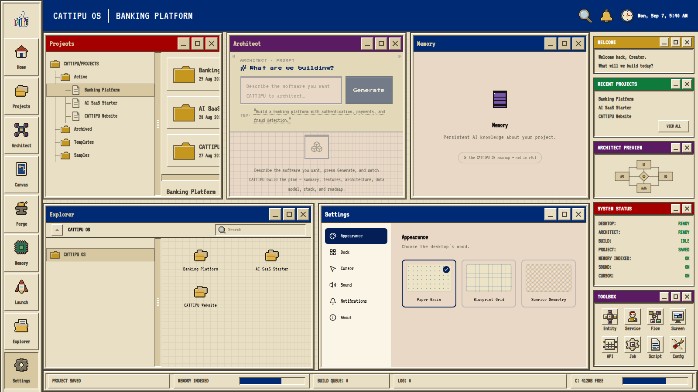
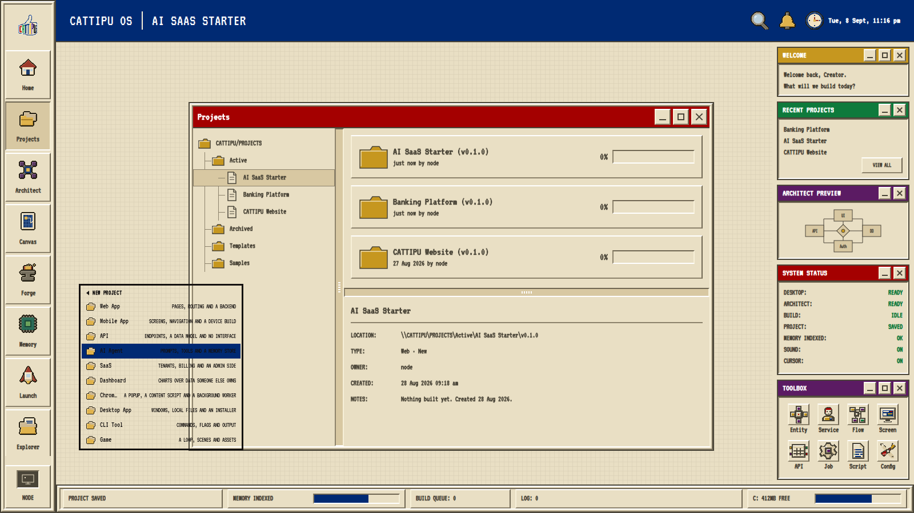

# CATTIPU OS

**The operating system for software creators.** v0.9 — Living Desktop.

Not a website with a desktop theme. A browser-based OS shell: a pixel boot
sequence resolving into an engineering-paper desktop with real objects you
can drag, a window manager that snaps and tiles and restores exactly, a
file explorer and a desktop that are two views of one filesystem, and
project templates that declare what is being built without pretending any
of it exists yet.



---

## What it does today

**A real desktop.** Icons are OS objects with an identity, a grid cell and
a parent — not decorations. Drag them, snap them to the grid, nest them in
folders, right-click for a mechanical context menu. The layout survives a
reload because positions are stored as **grid cells rather than pixels**,
so a desktop arranged on a 1920 screen lands correctly on a 1366 one.

**One filesystem, two views.** Explorer and the desktop read the same
array. `parentId === null` means the OS root, and the OS root *is* the
desktop — so a folder made in Explorer appears on the desktop, and a
folder made on the desktop appears in Explorer, with nothing to
synchronise because there is nothing to keep in step.

**A window manager that remembers.** Snap left/right/top/bottom with a
drag preview, Cascade, Tile, and a Restore that returns a window to its
exact size, position and z-order. Restoring a snapped-then-maximised
window goes back one level at a time, because a snap stores a *region*
rather than a rectangle. `Ctrl+Alt+C / T / R` reach cascade, tile and
restore-all when a tiled workspace leaves no desktop to right-click.

**Ten project templates.** Web App, Mobile App, API, AI Agent, SaaS,
Dashboard, Chrome Extension, Desktop App, CLI Tool, Game. Creating one
builds its workspace folders and a full project identity — target
platform, stack, deployment target, artifact state, build status — and
reports the project as **0% built**, because it is. An API gets no
`Screens` folder; the template does not lie about the shape of the thing.

**One action, every surface.** Creating a project reaches the Projects
window, Explorer, search, the desktop, Recent Projects and the title bar
from a single record. No duplicated state.

| | |
|---|---|
|  |  |
| The boot sequence | Explorer, showing the shared filesystem |
|  |  |
| Tile, with exact restore | The ten templates |

---

## Design rules

Two hold the project together, and both are enforced by tests rather than
by discipline.

**Nothing is stored that can be derived.** Progress, status and build
state have no setters — they are computed from what a project actually
contains, so no screen can be right while another is stale. A shortcut
stores a project *id*, never a name, so renaming a project renames every
shortcut with nothing to propagate.

**The Golden Master is the visual authority.** The v0.9 shell was signed
off as a render, and every sprint since is measured against it by pixel
comparison. Changes are allowed where a sprint asked for them and nowhere
else.

`docs/DESIGN_SYSTEM.md` and `docs/DESIGN_CONSTITUTION.md` carry the full
rules; `docs/ARCHITECTURE.md` explains the state layer.

---

## Installation

Requires Node 20 or newer (developed on 22).

```bash
git clone https://github.com/anirva09/cattipu-os.git
cd cattipu-os
npm install
npm run dev
```

Open <http://localhost:3000>.

> Install with **npm**. `package-lock.json` is the authoritative lockfile;
> `pnpm install` produces an incomplete `node_modules` that breaks
> linting. `pnpm run <script>` is fine once the install has happened.

---

## Development

| Command | What it does |
|---|---|
| `npm run dev` | Development server |
| `npm run build` | Production build |
| `npm start` | Serve the production build |
| `npm run typecheck` | `tsc --noEmit` |
| `npm run lint` | ESLint |
| `npm test` | 136 unit assertions across six suites in `tests/` |
| `npm run verify` | typecheck, lint and tests together |

### Behavioural harnesses

`scripts/*-verify.py` drive the production build in a real browser and
assert against it — **213 checks** covering desktop objects, Explorer, the
window manager, templates, propagation, the boot sequence, and every
application at all four supported viewports.

```bash
npm run build && npm start -- -p 3321      # in one shell
python3 scripts/m19-verify.py              # in another
```

They need Python with `playwright` and `pillow`.

**Every negative assertion in this project is mutation-tested.** A check
that cannot fail proves nothing, so each one is confirmed by deliberately
breaking the thing it watches and seeing it go red. The reports in
`docs/history/` record which mutations were used — including the cases
where a test looked fine and turned out to be vacuous.

### Layout

```
app/            Next.js routes, global stylesheet, boot mount
components/     The shell, its applications, and the frozen v0.9 package
design-system/  Tokens, bevel primitives, the icon registry
hooks/          App-level hooks
lib/            OS state layer — filesystem, projects, workspace, templates
store/          Zustand stores, persisted and versioned
tests/          Unit suites
scripts/        Verification harnesses, asset generators, release capture
docs/           Architecture, design system, roadmap; history/ holds the record
public/         pixelforge/ cursors/ wallpapers/ logo/ sounds/ assets/
```

`lib/os/extensions.ts` declares the seams the next milestones plug into —
the generation pipeline, deployment, plugins, wallpapers, cursor themes,
the notification centre. It implements nothing; it records the contract so
each decision is made once.

---

## Roadmap

v0.9 completes the **Living Desktop foundation**: real objects, a real
filesystem, workspace intelligence, and project identity.

Next, in order: mounting the Notification Centre and command palette in
the v0.9 shell, then the AI Workspace pipeline — Architect generating into
Canvas, Canvas into Forge — followed by Launch and deployment providers.
Full detail in `docs/ROADMAP.md`.

---

## Deployment

The app is a static Next.js build with no server-side state; everything
persists in the browser via `zustand/persist`. Any Next-capable host
works, Vercel included:

```bash
npm run build       # must be clean before deploying
```

`docs/DEPLOYMENT_REPORT.md` records the current release's verification and
the deployment checklist.

---

## License

MIT — see [LICENSE](LICENSE).
